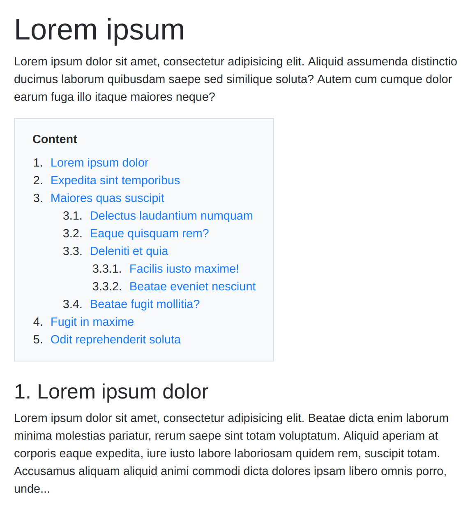

PHP Table of Contents
=============

A lightweight PHP library, for generating table of contents in the style of Wikipedia.
It automatically generates table of contents for your posts, pages and custom post types by parsing its contents for headers.
By doing so, you can let your readers jump to a corresponding header by clicking on a link in the TOC.
You can place this TOC anywhere in a post using the shortcodes.
You don’t have to add any links or create any anchors for this.
Built Wikipedia in mind, the table of contents by default appears before the first heading on a page.
You also get various methods to configure your TOC and control how it is going to appear.
Also, it sets no limit to the number of TOC you can create.
You can go on and have as many TOC as you want.

## Screenshots

They're rendered using the sample templates provided in the [templates](templates/) directory,
which depend on Bootstrap 4. 
You can easily use your own custom HTML to render the table of contents instead.

Default template:

 

## Installation

Install with composer:

    composer require ashtaev/toc

## Basic usage

Here's a quick example using the defaults:

    <?php
    
    require '../vendor/autoload.php';

    use ashtaev\Toc;

    $toc = new Toc($post);

    ?>
      
    <html>
        <head>
            <!-- The default, built-in template supports the Bootstrap 4 TOC styles. -->
            <link rel="stylesheet" href="https://stackpath.bootstrapcdn.com/bootstrap/4.3.1/css/bootstrap.min.css" integrity="sha384-ggOyR0iXCbMQv3Xipma34MD+dH/1fQ784/j6cY/iJTQUOhcWr7x9JvoRxT2MZw1T" crossorigin="anonymous">
            <link rel="stylesheet" href="css/toc.css">
        </head>
        <body>
      
        <h1>Lorem ipsum</h1>

        <?php 
            // Example of rendering the table of contents with the built-in template.
    
            echo $toc->getPostWhithToc(); 
        ?>
        
        </body>
    </html>

This will output the following:

    
Lorem ipsum... 

    

        
<b>Content</b>

        <ol>
            <li><a href="#Lorem_ipsum" title="Lorem ipsum">Lorem ipsum</a></li>
            <li><a href="#Expedita_sint" title="Expedita sint">Expedita sint</a></li>
            <li><a href="#Maiores_quas" title="Maiores quas">Maiores quas</a>
                <ol>
                    <li><a href="#Delectus_laudantium" title="Delectus laudantium">Delectus laudantium</a></li>
                    <li><a href="#Eaque_quisquam?" title="Eaque quisquam?">Eaque quisquam?</a></li>
                    <li><a href="#Deleniti_et" title="Deleniti et">Deleniti et</a>
                        <ol>
                            <li><a href="#Facilis_iusto!" title="Facilis iusto!">Facilis iusto!</a></li>
                            <li><a href="#Beatae_eveniet" title="Beatae eveniet">Beatae eveniet</a></li>
                        </ol>
                    </li>
                    <li><a href="#Beatae_fugit?" title="Beatae fugit?">Beatae fugit?</a></li>
                </ol>
            </li>
            <li><a href="#Fugit_in" title="Fugit in maxime">Fugit in maxime</a></li>
            <li><a href="#Odit_reprehenderit" title="Odit reprehenderit">Odit reprehenderit</a></li>
        </ol>
    

    
    <h2>"1. Lorem ipsum</h2>
    
    
Lorem ipsum dolor...

